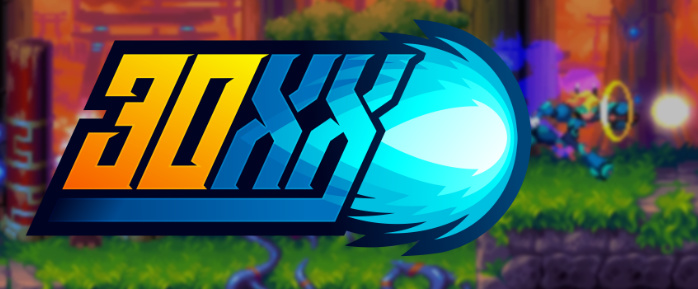
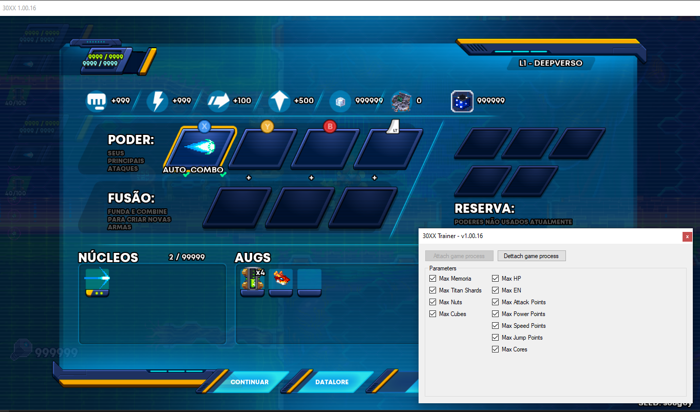
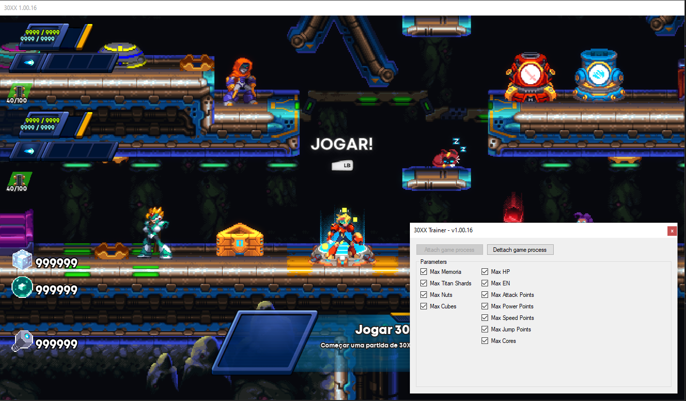

**Project README**

# 30XX Game Trainer

## Table of Contents

- [Introduction](#introduction)
- [Objective](#objective)
- [Features](#features)
- [Getting Started](#getting-started)
  - [Prerequisites](#prerequisites)
  - [Installation](#installation)
- [Usage](#usage)
- [Cheat Engine Table](#cheat-engine-table)
- [Contributing](#contributing)
- [License](#license)
- [Contact](#contact)

## Introduction

Welcome to the 30XX Game Trainer project! This repository contains a trainer program for the game 30XX. The trainer is designed to enhance the player's experience by providing various in-game advantages. The project is developed using C# and .NET Framework 4.8.

## Objective

The main objective of this project is to serve as a learning experience for both game modification and programming. By developing a trainer for 30XX, we aim to:

- Gain insights into game memory manipulation.
- Understand how to create a trainer interface.
- Improve our programming skills in C#.
- Learn how to collaborate on a software project using version control.

## Features

Our trainer project currently includes the following features:

- **Memoria:** Access and modify in-game memory values.
- **Titan Shards:** Increase the number of Titan Shards.
- **Nuts - Magic Number:** Modify the magic number for Nuts.
- **Nuts:** Increase the number of Nuts.
- **Cubes:** Collect more Cubes for upgrades.
- **Player 1 and Player 2:**
  - **HP:** Set the health points.
  - **Max HP:** Adjust the maximum health points.
  - **EN:** Modify the energy points.
  - **Max EN:** Adjust the maximum energy points.
  - **Attack Points:** Boost the attack points.
  - **Power Points:** Increase the power points.
  - **Speed Points:** Enhance the speed points.
  - **Jump Points:** Improve the jump points.
  - **Cores:** Modify the number of Cores.

Please note that the availability of these features may depend on the game version and other factors. Use this trainer responsibly and follow all terms of use provided by the game developers.

These features are just the beginning, and we plan to expand the trainer's capabilities over time.

## Trainer screenshot

## Getting Started

### Prerequisites

Before you begin, ensure you have met the following requirements:

- Install the game 30XX on your computer.
- Make sure you have [.NET Framework 4.8](https://dotnet.microsoft.com/download/dotnet-framework/net48) installed.

### Installation

1. Clone the repository to your local machine.
2. Build the solution using your preferred C# development environment.

## Usage

1. Launch the 30XX game.
2. Run the trainer executable you built.
3. Use the trainer interface to enable or disable various cheats according to your preference.

Remember, this trainer is intended for **single-player** and **offline** use only.

## Cheat Engine Table

Alongside the trainer program, we provide a Cheat Engine table (`cheat_engine_table.CT`) that contains memory addresses and pointers for important variables within the 30XX game. You can use this table to further explore the game's memory and develop additional cheats.

## Contributing

We welcome contributions from the community to enhance the trainer's functionality and compatibility. If you'd like to contribute, please follow these steps:

1. Fork the repository.
2. Create a new branch.
3. Make your enhancements.
4. Submit a pull request.

## License

This project is licensed under the [MIT License](LICENSE).

## Contact

If you have any questions, suggestions, or just want to say hello, you can reach us at [altairsossai@gmail.com](mailto:altairsossai@gmail.com) or through the [GitHub issues](link_to_issues_page).
